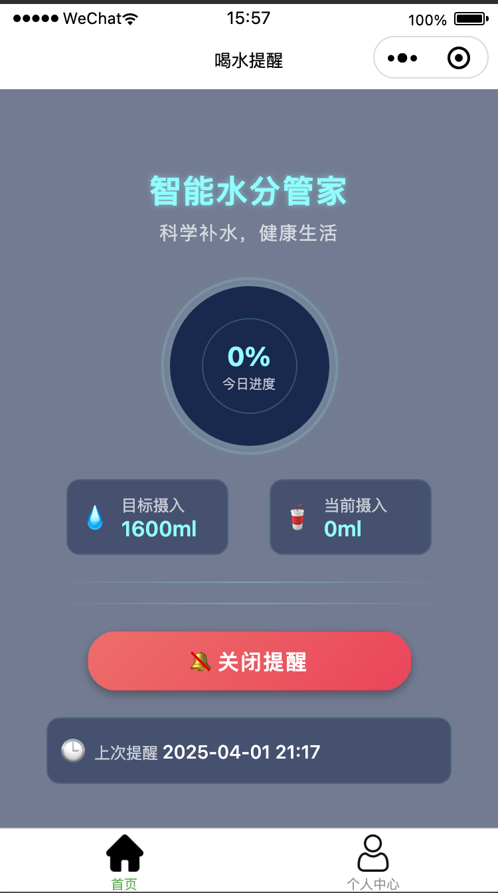

# 微信喝水提醒服务

这是一个基于微信小程序的智能喝水提醒服务，帮助用户养成健康的饮水习惯。通过订阅通知功能，用户可以接收定时的喝水提醒，追踪每日饮水量，实现科学补水。
后端代码在[这里](https://github.com/cyan0714/wx-mp-drink-water-api)


## 功能特点

- **智能喝水提醒**：通过微信订阅消息，定时提醒用户补充水分
- **饮水量追踪**：可视化展示每日饮水进度和目标完成情况
- **数据统计**：记录用户的饮水习惯，提供健康建议

## 应用截图

### 首页界面


### 饮水记录


### 个人设置


## 技术栈

- 前端框架：Vue 3 + uni-app
- 构建工具：Vite
- 平台支持：微信小程序

## 安装步骤

1. 克隆项目到本地

```bash
git clone https://github.com/cyan0714/wx-mp-drink-water.git
cd wx-mp-drink-water
```

2. 安装依赖

```bash
npm install
```

3. 配置环境变量

在项目根目录创建 `.env` 文件，并配置以下环境变量：

```
VUE_APP_SUBSCRIBE_TEMPLATE_ID=你的微信订阅消息模板ID
VUE_APP_BASE_URL=你的API服务地址
```

## 开发与构建

### 开发模式

```bash
# 微信小程序
npm run dev:mp-weixin

# H5版本
npm run dev:h5
```

### 构建生产版本

```bash
# 微信小程序
npm run build:mp-weixin

# H5版本
npm run build:h5
```

## 项目结构

```
├── src/                    # 源代码目录
│   ├── pages/              # 页面文件
│   │   ├── index/          # 首页
│   │   ├── profile/        # 个人资料页
│   │   └── progress/       # 进度统计页
│   ├── static/             # 静态资源
│   ├── utils/              # 工具函数
│   │   ├── api.js          # API请求封装
│   │   └── config.js       # 配置文件
│   ├── App.vue             # 应用入口组件
│   ├── main.js             # 应用入口文件
│   ├── manifest.json       # 应用配置文件
│   └── pages.json          # 页面路由配置
├── .env                    # 环境变量配置
├── package.json            # 项目依赖配置
└── vite.config.js          # Vite配置文件
```

## 注意事项

- 项目使用了微信小程序的订阅消息功能，需要在微信公众平台申请相应的模板ID
- 在微信开发者工具中调试时，需要在项目配置中关闭域名校验
- 生产环境部署时，需要确保API服务地址已备案并支持HTTPS

## 许可证

[MIT](LICENSE)
